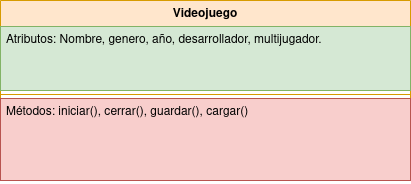

**Ejemplo paso a paso - Un automóvil y la POO**

**A continuación se presentan las principales consideraciones a la hora de aplicar los conceptos de la POO para representar clases, que permitan a su vez representar elementos del "mundo real", una conceptualización de una clase asociada y, finalmente una primera aprox. a código Java.**

